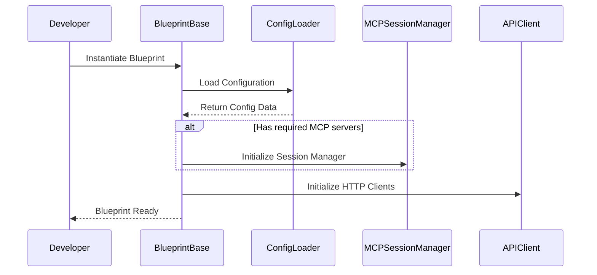
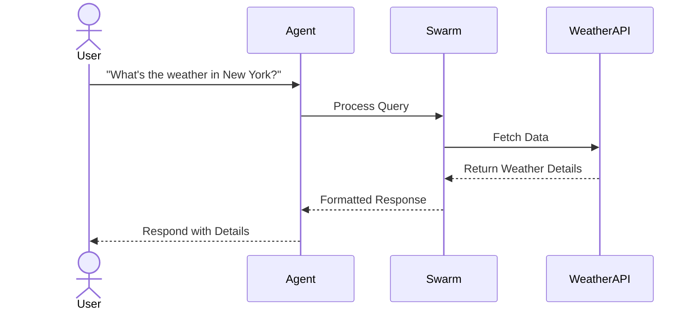
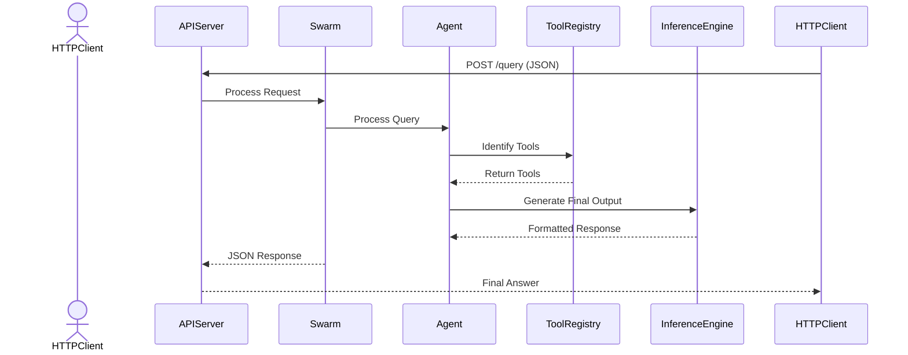

# (WIP) Development Documentation

This document provides an in-depth look at the **Swarm Framework**’s internal architecture, component interactions, and sequence flows for various operational modes. It is intended for developers and contributors who wish to modify or extend the framework.

---

## Table of Contents

- [High-Level Architecture](#high-level-architecture)
- [Detailed Sequence Diagrams](#detailed-sequence-diagrams)
  - [1. Blueprint Initialization](#1-blueprint-initialization)
  - [2. Agent Interaction Flow](#2-agent-interaction-flow)
  - [3. REST API Mode Interaction](#3-rest-api-mode-interaction)
- [Project Layout](#project-layout)
- [API Endpoints](#api-endpoints)
- [Advanced Topics](#advanced-topics)

---

## Detailed Sequence Diagrams

### 1. Blueprint Initialization



### 2. Agent Interaction Flow



### 3. REST API Mode Interaction

Below is a simplified sequence diagram of the REST API interaction using Mermaid:



---

## Project Layout

Updated directory structure for the unified framework:

```
src/
    swarm/
        agent/                 # Agent definitions and orchestration
        blueprint/             # Blueprint base classes and implementations
        config/                # Configuration loading and validation
        core.py                # Core Swarm framework logic
        extensions/            # Optional integrations (REST, GPT actions)
        repl/                  # Interactive REPL for agents
        rest/                  # REST API views and endpoints
        types.py               # Type definitions for agents and tools
        util.py                # Utility functions
tests/
    test_blueprints.py         # Tests for blueprint discovery and metadata
    test_rest_mode.py          # Tests for REST API endpoints
    test_config_loader.py      # Tests for configuration loading
    test_swarm/                # Tests for Swarm framework
docs/
    diagrams/                  # Architecture and sequence diagrams
```

---

## API Endpoints

### CLI Mode

- **No HTTP endpoints**. Interact directly with the framework using the CLI.

### REST Mode

- **`POST /v1/query`**: Accepts JSON payloads, returning agent responses in OpenAI-compatible format.
- **`GET /v1/models`**: Lists all available models (blueprints).

### MCP Mode

- **`list_tools`**: Enumerates available tools in the MCP environment.
- **`execute_tool`**: Executes a specified tool with arguments.

---

## Advanced Topics

### Handling Blueprints and Configuration

This section provides an overview of managing blueprints and the configuration system, including how to mock components for testing and ensure the framework operates as expected.

#### 1. Blueprint Initialization
Blueprints inherit from `BlueprintBase` and require a configuration object during initialization. The configuration specifies runtime behavior, paths, and tool availability.

**Key Steps:**
- Ensure your blueprint class inherits from `BlueprintBase`.
- Pass the `config` parameter to the constructor, which can be loaded using the `ConfigLoader`.

Example:
```python
from swarm.blueprint.base import BlueprintBase
from swarm.config.loader import ConfigLoader

config = ConfigLoader.load("path/to/config.json")
class MyBlueprint(BlueprintBase):
    def __init__(self, config):
        super().__init__(config)
        # Custom initialization here
```

#### 2. Blueprint Testing
Use pytest fixtures to mock dependencies and provide a robust test environment. Mock objects like `MCPSession` and `Swarm` should be employed to isolate tests.

**Common Fixtures:**
- `mock_mcp_session`: Mocks MCP session calls for tools.
- `mock_config`: Provides a sample or dummy configuration.
- `temporary_blueprints_dir`: Creates a temporary directory structure for testing blueprints.

Example Fixture:
```python
@pytest.fixture
def mock_config(tmp_path):
    config_path = tmp_path / "swarm_config.json"
    config_path.write_text("{...}")  # Populate with mock configuration
    return str(config_path)
```

#### 3. Configuration in Tests
Configuration can either be mocked or use a predefined test configuration (`./swarm_config.json`). Update the `PYTHONPATH` during tests to include `src/` for proper imports.

Command:
```bash
PYTHONPATH=$(pwd)/src pytest
```

---

### Updated Sequence for Blueprint Integration

1. **Configuration Loading**  
   Blueprints fetch their configuration from `ConfigLoader`. Ensure paths are set correctly in tests to point to either mock configurations or test-specific paths.

2. **Blueprint Discovery**  
   Use `discover_blueprints` to dynamically locate and load available blueprints. This method scans the `blueprints/` directory and ensures only properly defined blueprints are loaded.

Example:
```python
from swarm.extensions.blueprint.discovery import discover_blueprints

blueprints = discover_blueprints(["blueprints/filesystem"])
```

3. **Testing MCP and Tool Calls**  
   Mock tool calls by replacing `call_tool` in the MCP session. This allows testing the integration of tools like `list_directory`, `read_file`, etc.

Example Mock:
```python
mock_mcp_session.call_tool.return_value = Mock(content=[Mock(text="file1.txt\nfile2.txt")])
```

---

This addition provides developers with a focused guide to integrating and testing blueprints, ensuring adherence to framework standards.

### Dynamic Tool Integration in Blueprints

#### Overview
Blueprints in the Swarm framework can dynamically integrate tools discovered through MCP servers. This capability enables flexible functionality without hardcoding tool logic within the blueprint.

#### Dynamic Tools
A **Tool** in Swarm is represented by the `Tool` class, which encapsulates:
- `name`: The tool's identifier.
- `func`: The callable function associated with the tool.
- `description`: A brief explanation of what the tool does.
- `input_schema`: The expected input parameters, defined in JSON Schema.
- `dynamic`: A flag indicating if the tool is dynamically generated.

Tools are dynamically discovered by the `MCPToolProvider` during runtime. This process involves querying an MCP server and retrieving tool definitions, which are then injected into the corresponding blueprint or agent.

#### Testing Dynamic Tools
Dynamic tools require a special approach for testing due to their runtime discovery.

1. **Mocking Tools**:
   Tools should be mocked as instances of the `Tool` class. Define their behavior by assigning mock `func` functions and setting appropriate schemas.

2. **Mocking Tool Discovery**:
   Use a mock `MCPToolProvider` to simulate tool discovery. This ensures the blueprint or agent can integrate tools as if they were retrieved from a live server.

3. **Testing Tool Behavior**:
   - Validate that tools are callable and produce expected results.
   - Ensure tools adhere to their defined input schemas.

#### Example Test Setup
Below is an example of testing a `list_directory` tool dynamically integrated into a blueprint:

```python
@pytest.mark.asyncio
async def test_list_directory(mock_mcp_session):
    from swarm.types import Tool

    async def mock_list_directory_func(path):
        return f"Contents of '{path}':\n[FILE] file1.txt\n[FILE] file2.txt"

    mock_tool = Tool(
        name="list_directory",
        func=mock_list_directory_func,
        description="List directory contents",
        input_schema={"type": "object", "properties": {"path": {"type": "string"}}, "required": ["path"]},
        dynamic=True,
    )

    async def mock_discover_tools():
        return {"list_directory": mock_tool}

    mock_tool_provider = AsyncMock()
    mock_tool_provider.discover_tools = mock_discover_tools

    blueprint_instance = FilesystemBlueprint(config={"allowed_paths": ["/tmp"]})
    blueprint_instance.mcp_session = mock_mcp_session
    blueprint_instance.tool_provider = mock_tool_provider

    tools = await blueprint_instance.tool_provider.discover_tools()
    list_directory = tools["list_directory"]

    result = await list_directory(path="/path/to/dir")

    assert result == "Contents of '/path/to/dir':\n[FILE] file1.txt\n[FILE] file2.txt"


### Blueprint Flexibility

Blueprints can:
- Use **MCP servers** for tools and actions.
- Call **direct HTTP APIs** for tasks like weather queries.
- Employ **GPT actions** as an alternative tool execution method.

### Scaling

- Use a reverse proxy (e.g., Nginx) for REST endpoints.
- Scale horizontally with multiple REST or MCP instances sharing the same configuration.

### Security

- Keep sensitive data in `.env`.
- Leverage Docker secrets or Kubernetes secrets for secure deployments.

---

For contributions or additional help, refer to our [Contributing Guidelines](../README.md#contributing).


## Operational Modes

1. **REST Mode**  
   - Launch Django with `uv run manage.py runserver 0.0.0.0:8000`.  
   - Access endpoints:
     - `POST /v1/chat/completions`: Chat-style agent interactions (OpenAI-compatible).
     - `GET /v1/models`: Lists available blueprints.
     - `http://localhost:8000/<blueprint_name>/`: Interactive, web-based blueprint tester.
   - (TODO) Optionally integrate with Django Admin at `/admin`.

2. **CLI Mode**  
   - Execute specific blueprint files (e.g., `uv run blueprints/university/blueprint_university.py`).  
   - Great for local testing, debugging, and iterative development.

---

## Configuration & Multiple LLM Providers

Open Swarm uses:
- **`.env`** files for API keys or critical environment variables (e.g., `OPENAI_API_KEY`).
- **`swarm_config.json`** (or custom JSON) for advanced settings, including:
  - **`llm`**: Define multiple OpenAI-compatible endpoints (e.g., `openai`, `grok`, `ollama`). Configurable LLM Providers are fully supported and now allow you to specify additional parameters such as `temperature` and `reasoning`. The `reasoning` parameter is particularly useful for setups like o3-mini.
  - **`mcp_servers`**: Tools/services that agents can call.

Different agents in a single blueprint can reference different LLM providers. For example:
```json
{
  "llm": {
    "openai": {
      "provider": "openai",
      "model": "gpt-4",
      "base_url": "https://api.openai.com/v1",
      "api_key": "${OPENAI_API_KEY}",
      "temperature": 0.7,
    },
    "grok": {
      "provider": "openai",
      "model": "grok-2-1212",
      "base_url": "https://api.x.ai/v1",
      "api_key": "${XAI_API_KEY}"
    },
    "ollama": {
      "provider": "openai",
      "model": "llama3.2",
      "base_url": "http://localhost:11434/v1",
      "api_key": ""
    }
  }
}
```

---

## Installation

1. **Clone the Repository**  
   ```bash
   git clone https://github.com/matthewhand/open-swarm.git
   cd open-swarm
   ```
2. **Install Dependencies**  
   ```bash
   # Install 'uv' => https://docs.astral.sh/uv/
   uv python install 3.12
   uv venv
   source .venv/bin/activate
   uv sync
   ```
3. **Environment Setup**  
   - Copy `.env.example` to `.env` and fill in sensitive details (`OPENAI_API_KEY`, etc.).
   ```bash
   cp .env.example .env
   vi .env
   ```
   - *(Optional)* Update `swarm_config.json` to add or modify LLM providers, MCP servers, etc.

---

## Running Open Swarm

### Running with the REST API

1.  **Start the Django REST API Server:**
    ```bash
    uv run manage.py migrate
    uv run manage.py runserver 0.0.0.0:8000
    ```
2.  **Access the Interactive Blueprint Pages:**
    - Open your web browser and visit:
      - `http://localhost:8000/<blueprint_name>` (e.g., `http://localhost:8000/university`)
      - You will see a text input where you can type queries.
      - The `sender` of the response (the name of the agent that responded) will be shown above each response.
      - Below is a screenshot showing an example of the interactive HTML page:
      
          
3.  **Integrate with Open WebUI:**
    - Open Swarm has full compatibility with OpenAI API-compatible UIs, such as [Open WebUI](https://github.com/open-webui/open-webui). By using a client like Open WebUI you will not only see the `sender` field, but also experience a more engaging chat UI with other features.
    - To configure Open WebUI to use Open Swarm:
      - Start the REST API server via `uv run manage.py runserver 0.0.0.0:8000`
      - Install the custom function from the [Open WebUI Functions Hub](https://openwebui.com/f/matthewh/swarm_manifold).
      - In the custom function valve settings, change the API Base URL if different to the default, `http://host.docker.internal:8000`
    - To see a demo of Open WebUI with the University Blueprint with expressive voice output, please see the following demonstration video:
    
      https://github.com/user-attachments/assets/a4688100-5737-479f-91e5-974db98296d7
4.  **Access the REST Endpoints Directly:**
    You can also interact with the API using a tool like `curl`. For example:
    ```bash
    curl -X POST http://localhost:8000/v1/chat/completions \
        -H "Content-Type: application/json" \
        -d '{"model":"university","messages":[{"role":"user","content":"What courses should I take next semester if I’m interested in data science?"}]}'
    ```
    - You will see a JSON response, containing the `sender` field within the response (in `data.choices[0].message.sender`).

---

## Deploying with Docker

### Deploy with Docker Compose (Recommended)

1. **Obtain `docker-compose.yaml`**  
   ```bash
   wget https://raw.githubusercontent.com/matthewhand/open-swarm/refs/heads/main/docker-compose.yaml
   ```
2. **Set up `.env`**  
   Retrieve the `.env` template and configure the `OPENAI_API_KEY`:
   ```bash
   wget https://raw.githubusercontent.com/matthewhand/open-swarm/refs/heads/main/.env.example -O .env
   sed -i 's/^OPENAI_API_KEY=.*/OPENAI_API_KEY=your_openai_api_key_here/' .env
   ```
   Replace `your_openai_api_key_here` with your actual OpenAI API key.
3. **(Optional) Adjust `swarm_config.json`**  
   Download and modify `swarm_config.json` if you plan to use local LLM endpoints or different providers.
4. **Start the Service**  
   ```bash
   docker compose up -d
   ```
   This:
   - Builds the image if needed.
   - Reads port settings and environment variables from `.env`.
   - Exposes the application on `8000` (unless overridden via `$PORT`).

5. **Access the Application**  
   - Visit [http://localhost:8000](http://localhost:8000) for the interactive blueprint pages.

### Deploy Standalone 

1. Configure `.env` (mandatory) and `swarm_config.json` (optional) as above
2. Run the following command:
   ```bash
   docker run \
     --env-file .env \
     -p ${PORT:-8000}:${PORT:-8000} \
     -v ./blueprints:/app/blueprints \
     -v ./swarm_config.json:/app/src/swarm/swarm_config.json \
     --name open-swarm \
     --restart unless-stopped \
     mhand79/open-swarm:latest
   ```

---

## Diagram: Backend HTTP Service Overview

Below is a simplified diagram illustrating how the **Open Swarm** HTTP service can function as a backend for any OpenAI API-compatible client or tool. The service lists configured **Blueprints** via `/v1/models` and performs inference through the `/v1/chat/completions` endpoint. Internally, it can call out to any configured **OpenAI-compatible LLM provider** (OpenAI, Grok, Ollama, etc.) and optionally run **MCP servers** (like database, filesystem, or weather integrations).

```
 ┌─────────────────────────────────────────────────────────────────────┐
 │        OpenAI-Compatible Client Tools that displays sender        │
 │                      e.g. Open-WebUI                              │
 └────────────┬───────────────────────────────────────────────────────┘
              |                             
              |   (HTTP: /v1/chat/completions, /v1/models)
              ▼                             
 ┌─────────────────────────────────────────────────────────────────────┐
 │                 Open Swarm REST API Service (Django)              │
 │  (Exposes /v1/models, /v1/chat/completions, /admin, /<blueprint>)   │
 └─────────────────────────────────────────────────────────────────────┘
                     |                        | 
                     |                        | MCP Servers and 
                     |                        | (filesystem, database, etc.)           
       LLM Inference |                        |                     
                     ▼                        ▼                
       ┌────────────────────────┐         ┌────────────────────────┐
       │OpenAI-Compatible LLMs  │         │ External APIs/Services │
       │ (OpenAI, Grok, Ollama) │         │ (Weather, Database, ..)│
       └────────────────────────┘         └────────────────────────┘
```

---

## Progress Tracker

- **REST Mode**
  - [x] Inference via `/v1/chat/completions`
  - [x] Blueprints listed via `/v1/models/`
  - [x] Execute blueprints via `/<blueprint>` e.g. [http://localhost:8000/university](http://localhost:8000/university)
  - [x] Simple HTML page
  - [ ] Application management via `/admin`
     - [x] User management
     - [ ] Blueprint management
  - [ ] Streaming chat (django_chat)

- **CLI Mode**
  - [x] Blueprint Runner
  - [ ] Setup Wizard

- **Multiple LLM Providers**
  - [x] Assign different models per agent in one blueprint

- **Tooling Integration Frameworks**
  - [x] MCP Servers implementation
    - [x] npx-based server integration
    - [ ] uvx server reliability improvements (fix frozen processes)
  - [x] Official MCP Python SDK integration
  - [x] Brave Search API integration
  - [x] SQLite database integration
  - [x] Filesystem access integration

- **Core Framework Improvements**
  - [x] Dynamic environment variable documentation
    - [x] .env.example template
    - [x] README.md configuration section
  - [x] Autocompletion with dynamic goal tracking
  - [x] Nested progress tracking implementation
  - [x] Interactive task resumption handling

- **Deployment**
  - [x] Dockerfile and docker-compose.yaml
  - [x] Publish to Docker Registry
  - [x] Publish Python module to PyPI

- **Example Blueprints**
  - [x] `echocraft` (Simple blueprint for function call)
  - [x] `suggestion` (Simple blueprint demonstrating constrained JSON output)
  - [x] `database_and_web` (Demonstrates MCP server integrations: Brave Search API & SQLite database; Brave requires API key)
  - [x] `university` (Demonstrates Django integration with additional REST endpoints at `/v1/university/` alongside `/v1/models` and `/v1/chat/completions`)
  - [ ] `flowise` (pending uvx fix)

- **Security**
  - [x] REST endpoint authentication
    - [x] API key protection (ENABLE_API_AUTH)
    - [x] Per-user token system
  - [x] Operational mode controls
    - [x] Disable admin interface (ENABLE_ADMIN)
    - [x] Disable web UI (ENABLE_WEBUI)
  - [ ] CORS access control

- **Beta Features**
  - [x] Blueprints can extend Django DB and REST.
  - [ ] Automatic MCP server config loading
    - [x] Claude Desktop on Windows
    - [x] Roo-CLI on Linux remote SSH
    - [ ] Others
  - [ ] Implement swarm-cli and swarm-api commands
    - [x] Manage blueprints
    - [x] Host the API endpoint
    - [ ] Compile blueprints into standalone CLI commands for shell execution.
  - [ ] Nemo_guardrails integration
    - [x] Register config
    - [ ] Register actions (currently breaks function calling)
  - [ ] Develop more complex chat UI
    - [x] HTML concept layout
    - [ ] Conversation history
  - [ ] Automated task completion for CLI mode 
    - [x] Automatically assess goal completion
    - [x] Continue generation until achieved
    - [ ] Unit testing

- **Security**
  - [x] REST endpoint authentication
    - [x] API key protection (ENABLE_API_AUTH)
    - [x] Per-user token system
  - [x] Operational mode controls
    - [x] Disable admin interface (ENABLE_ADMIN)
    - [x] Disable web UI (ENABLE_WEBUI)
  - [x] Restricted blueprint loading via SWARM_BLUEPRINTS environment variable
  - [ ] CORS access control
