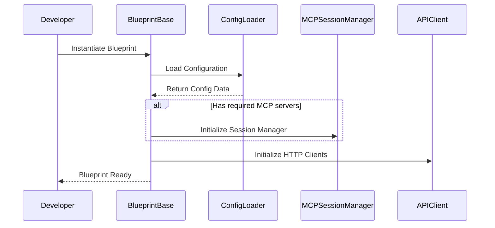
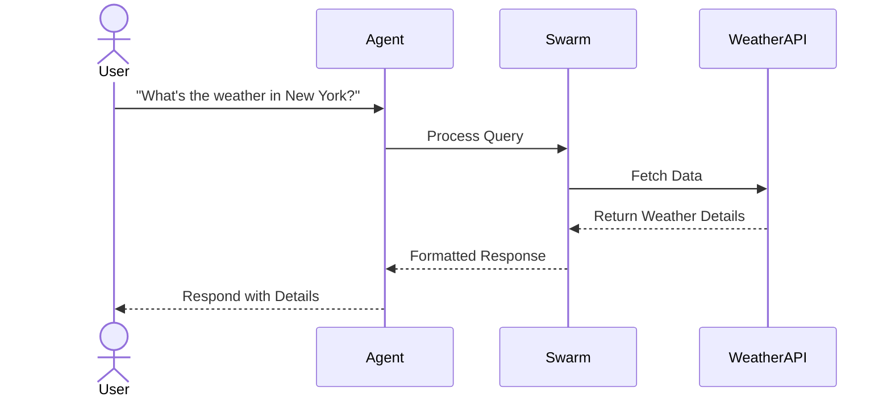
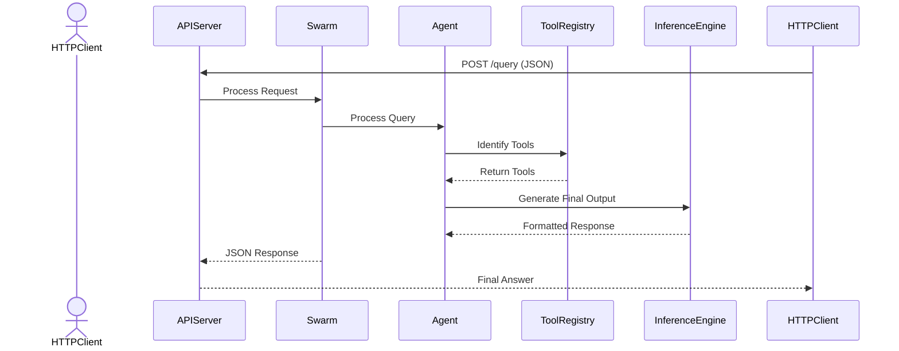

# (WIP) Development Documentation

This document provides an in-depth look at the **Swarm Framework**’s internal architecture, component interactions, and sequence flows for various operational modes. It is intended for developers and contributors who wish to modify or extend the framework.

---

## Table of Contents

- [High-Level Architecture](#high-level-architecture)
- [Detailed Sequence Diagrams](#detailed-sequence-diagrams)
  - [1. Blueprint Initialization](#1-blueprint-initialization)
  - [2. Agent Interaction Flow](#2-agent-interaction-flow)
  - [3. REST API Mode Interaction](#3-rest-api-mode-interaction)
- [Project Layout](#project-layout)
- [API Endpoints](#api-endpoints)
- [Advanced Topics](#advanced-topics)

---

## Detailed Sequence Diagrams

### 1. Blueprint Initialization



### 2. Agent Interaction Flow



### 3. REST API Mode Interaction

Below is a simplified sequence diagram of the REST API interaction using Mermaid:



---

## Project Layout

Updated directory structure for the unified framework:

```
src/
    swarm/
        agent/                 # Agent definitions and orchestration
        blueprint/             # Blueprint base classes and implementations
        config/                # Configuration loading and validation
        core.py                # Core Swarm framework logic
        extensions/            # Optional integrations (REST, GPT actions)
        repl/                  # Interactive REPL for agents
        rest/                  # REST API views and endpoints
        types.py               # Type definitions for agents and tools
        util.py                # Utility functions
tests/
    test_blueprints.py         # Tests for blueprint discovery and metadata
    test_rest_mode.py          # Tests for REST API endpoints
    test_config_loader.py      # Tests for configuration loading
    test_swarm/                # Tests for Swarm framework
docs/
    diagrams/                  # Architecture and sequence diagrams
```

---

## API Endpoints

### CLI Mode

- **No HTTP endpoints**. Interact directly with the framework using the CLI.

### REST Mode

- **`POST /v1/query`**: Accepts JSON payloads, returning agent responses in OpenAI-compatible format.
- **`GET /v1/models`**: Lists all available models (blueprints).

### MCP Mode

- **`list_tools`**: Enumerates available tools in the MCP environment.
- **`execute_tool`**: Executes a specified tool with arguments.

---

## Advanced Topics

### Handling Blueprints and Configuration

This section provides an overview of managing blueprints and the configuration system, including how to mock components for testing and ensure the framework operates as expected.

#### 1. Blueprint Initialization
Blueprints inherit from `BlueprintBase` and require a configuration object during initialization. The configuration specifies runtime behavior, paths, and tool availability.

**Key Steps:**
- Ensure your blueprint class inherits from `BlueprintBase`.
- Pass the `config` parameter to the constructor, which can be loaded using the `ConfigLoader`.

Example:
```python
from swarm.blueprint.base import BlueprintBase
from swarm.config.loader import ConfigLoader

config = ConfigLoader.load("path/to/config.json")
class MyBlueprint(BlueprintBase):
    def __init__(self, config):
        super().__init__(config)
        # Custom initialization here
```

#### 2. Blueprint Testing
Use pytest fixtures to mock dependencies and provide a robust test environment. Mock objects like `MCPSession` and `Swarm` should be employed to isolate tests.

**Common Fixtures:**
- `mock_mcp_session`: Mocks MCP session calls for tools.
- `mock_config`: Provides a sample or dummy configuration.
- `temporary_blueprints_dir`: Creates a temporary directory structure for testing blueprints.

Example Fixture:
```python
@pytest.fixture
def mock_config(tmp_path):
    config_path = tmp_path / "swarm_config.json"
    config_path.write_text("{...}")  # Populate with mock configuration
    return str(config_path)
```

#### 3. Configuration in Tests
Configuration can either be mocked or use a predefined test configuration (`./swarm_config.json`). Update the `PYTHONPATH` during tests to include `src/` for proper imports.

Command:
```bash
PYTHONPATH=$(pwd)/src pytest
```

---

### Updated Sequence for Blueprint Integration

1. **Configuration Loading**  
   Blueprints fetch their configuration from `ConfigLoader`. Ensure paths are set correctly in tests to point to either mock configurations or test-specific paths.

2. **Blueprint Discovery**  
   Use `discover_blueprints` to dynamically locate and load available blueprints. This method scans the `blueprints/` directory and ensures only properly defined blueprints are loaded.

Example:
```python
from swarm.extensions.blueprint.discovery import discover_blueprints

blueprints = discover_blueprints(["blueprints/filesystem"])
```

3. **Testing MCP and Tool Calls**  
   Mock tool calls by replacing `call_tool` in the MCP session. This allows testing the integration of tools like `list_directory`, `read_file`, etc.

Example Mock:
```python
mock_mcp_session.call_tool.return_value = Mock(content=[Mock(text="file1.txt\nfile2.txt")])
```

---

This addition provides developers with a focused guide to integrating and testing blueprints, ensuring adherence to framework standards.

### Dynamic Tool Integration in Blueprints

#### Overview
Blueprints in the Swarm framework can dynamically integrate tools discovered through MCP servers. This capability enables flexible functionality without hardcoding tool logic within the blueprint.

#### Dynamic Tools
A **Tool** in Swarm is represented by the `Tool` class, which encapsulates:
- `name`: The tool's identifier.
- `func`: The callable function associated with the tool.
- `description`: A brief explanation of what the tool does.
- `input_schema`: The expected input parameters, defined in JSON Schema.
- `dynamic`: A flag indicating if the tool is dynamically generated.

Tools are dynamically discovered by the `MCPToolProvider` during runtime. This process involves querying an MCP server and retrieving tool definitions, which are then injected into the corresponding blueprint or agent.

#### Testing Dynamic Tools
Dynamic tools require a special approach for testing due to their runtime discovery.

1. **Mocking Tools**:
   Tools should be mocked as instances of the `Tool` class. Define their behavior by assigning mock `func` functions and setting appropriate schemas.

2. **Mocking Tool Discovery**:
   Use a mock `MCPToolProvider` to simulate tool discovery. This ensures the blueprint or agent can integrate tools as if they were retrieved from a live server.

3. **Testing Tool Behavior**:
   - Validate that tools are callable and produce expected results.
   - Ensure tools adhere to their defined input schemas.

#### Example Test Setup
Below is an example of testing a `list_directory` tool dynamically integrated into a blueprint:

```python
@pytest.mark.asyncio
async def test_list_directory(mock_mcp_session):
    from swarm.types import Tool

    async def mock_list_directory_func(path):
        return f"Contents of '{path}':\n[FILE] file1.txt\n[FILE] file2.txt"

    mock_tool = Tool(
        name="list_directory",
        func=mock_list_directory_func,
        description="List directory contents",
        input_schema={"type": "object", "properties": {"path": {"type": "string"}}, "required": ["path"]},
        dynamic=True,
    )

    async def mock_discover_tools():
        return {"list_directory": mock_tool}

    mock_tool_provider = AsyncMock()
    mock_tool_provider.discover_tools = mock_discover_tools

    blueprint_instance = FilesystemBlueprint(config={"allowed_paths": ["/tmp"]})
    blueprint_instance.mcp_session = mock_mcp_session
    blueprint_instance.tool_provider = mock_tool_provider

    tools = await blueprint_instance.tool_provider.discover_tools()
    list_directory = tools["list_directory"]

    result = await list_directory(path="/path/to/dir")

    assert result == "Contents of '/path/to/dir':\n[FILE] file1.txt\n[FILE] file2.txt"


### Blueprint Flexibility

Blueprints can:
- Use **MCP servers** for tools and actions.
- Call **direct HTTP APIs** for tasks like weather queries.
- Employ **GPT actions** as an alternative tool execution method.

### Scaling

- Use a reverse proxy (e.g., Nginx) for REST endpoints.
- Scale horizontally with multiple REST or MCP instances sharing the same configuration.

### Security

- Keep sensitive data in `.env`.
- Leverage Docker secrets or Kubernetes secrets for secure deployments.

---

For contributions or additional help, refer to our [Contributing Guidelines](../README.md#contributing).
