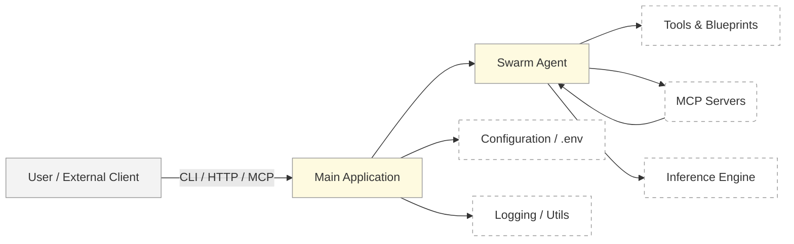
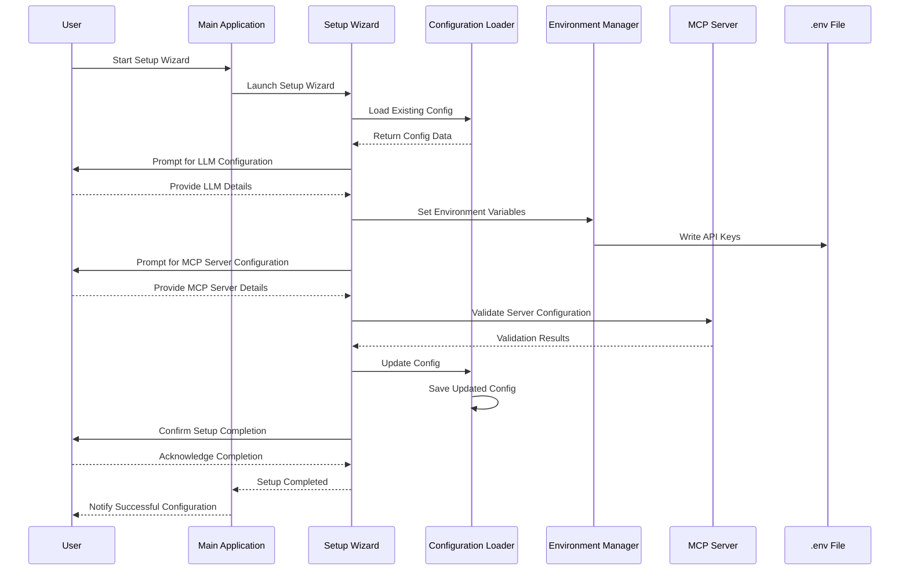
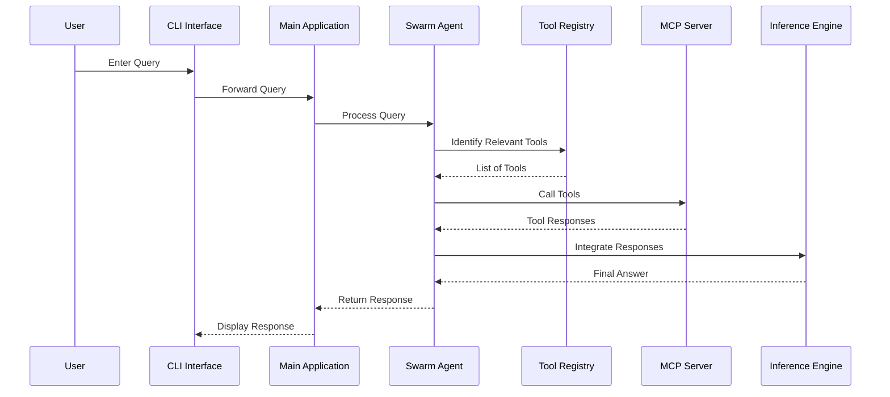
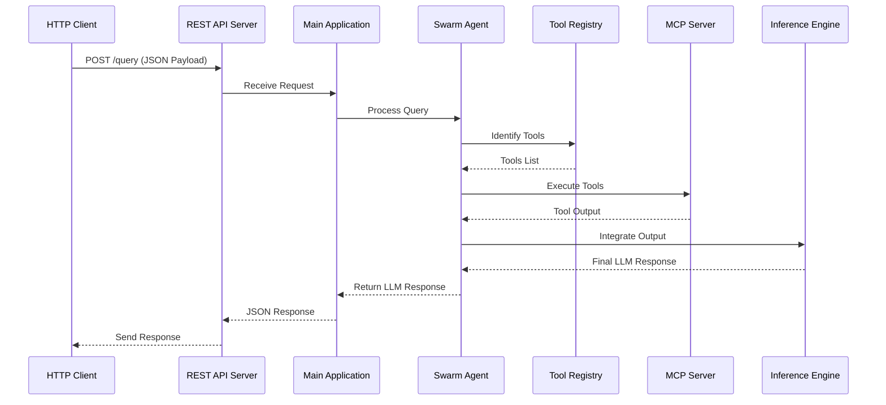
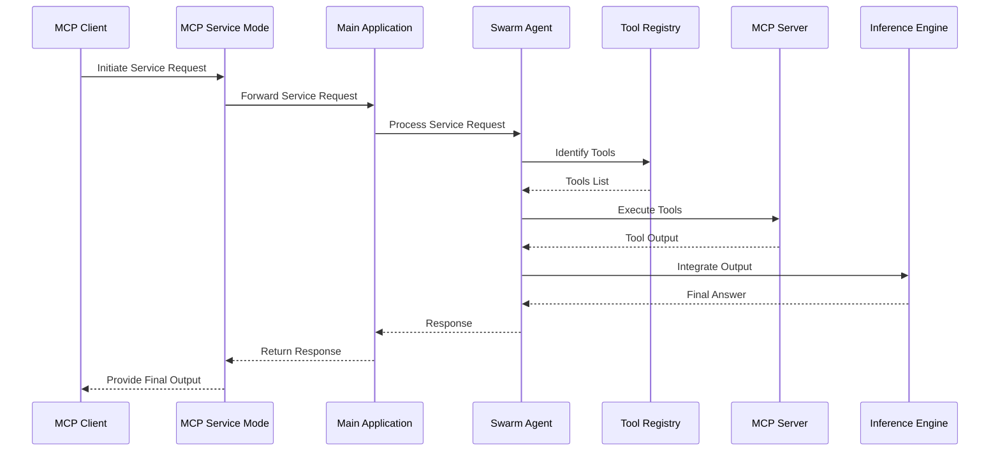

# Development Documentation

This document provides an in-depth look at **Open Swarm MCP**’s internal architecture, component interactions, and sequence flows for various operational modes. It is intended for developers and contributors who wish to modify or extend the framework.

---

## Table of Contents

- [High-Level Architecture](#high-level-architecture)
- [Detailed Sequence Diagrams](#detailed-sequence-diagrams)
  - [1. Setup Wizard Interaction](#1-setup-wizard-interaction)
  - [2. CLI Mode Interaction](#2-cli-mode-interaction)
  - [3. REST API Mode Interaction](#3-rest-api-mode-interaction)
  - [4. MCP Service Mode Interaction](#4-mcp-service-mode-interaction)
- [Project Layout](#project-layout)
- [API Endpoints](#api-endpoints)
- [Advanced Topics](#advanced-topics)

---

## High-Level Architecture

Below is a simplified **Open Swarm MCP** architecture diagram illustrating the primary components and data flow:



1. **Main Application**: The entry point (e.g., CLI, REST, or MCP service).
2. **Swarm Agent**: The central agentic component that manages instructions and tool usage.
3. **Tools & Blueprints**: Definitions of how the agent interacts with MCP servers or local logic.
4. **MCP Servers**: External processes or services that execute specific tool actions.
5. **Inference Engine**: The LLM or logic that the agent uses to generate coherent responses.
6. **Configuration / .env**: Stores sensitive keys and references to MCP servers.
7. **Logging / Utils**: Shared utilities for logging, colored outputs, etc.

---

## Detailed Sequence Diagrams

The following Mermaid-based sequence diagrams provide deeper insights into **Open Swarm MCP**’s operational flow across different modes and during setup.

### 1. Setup Wizard Interaction



- **Role**: Configures LLM settings, MCP servers, and writes sensitive info to `.env`.
- **Key Steps**: 
  1. Wizard prompts user for details.
  2. Checks existing configuration.
  3. Writes API keys to `.env`.
  4. Updates final `mcp_server_config.json`.

### 2. CLI Mode Interaction



- **Ideal Usage**: Local prototyping and debugging.
- **Real-Time**: The user sees immediate responses from the agent.

### 3. REST API Mode Interaction



- **Key Benefit**: 
  - Exposes a chat completions endpoint akin to the OpenAI API.
  - Allows external UIs (like **Open-WebUI**, **LocalAI**, etc.) to plug in easily.

### 4. MCP Service Mode Interaction



- **Usage**: 
  - Full MCP compliance for advanced agent collaborations.
  - Agents can hand off tasks to each other or remote MCP services.

---

## Project Layout

While the [README.md](../README.md) provides an **at-a-glance** structure, here is a more developer-focused breakdown:

```bash
open-swarm-mcp/
├── src/
│   └── open_swarm_mcp/
│       ├── agent/              # Agent classes, building logic, tool registration
│       ├── config/             # Setup wizard, config loader, env management
│       ├── examples/           # Sample blueprints and MCP server configurations
│       ├── modes/              # CLI, REST, and MCP-service mode implementations
│       └── utils/              # Logging, color output, shared utilities
├── docs/                       # Additional documentation (this file, diagrams, etc.)
├── .env.example                # Example environment file
├── docker-compose.yml          # Example Docker setup
├── pyproject.toml / requirements.txt
└── README.md
```

### Notable Directories

- **`modes/`**: Each Python module corresponds to a different operational mode.
- **`agent/`**: Houses `agent_builder.py`, which constructs agents with dynamic tools based on configuration.
- **`utils/`**: Provides foundational services like logging (`logger.py`) and color-coded outputs (`color_utils.py`).

---

## API Endpoints

1. **CLI Mode**  
   - **No HTTP endpoints**. Operates purely via interactive console commands.

2. **REST Mode**  
   - **`POST /query`**: Receives user messages, returns JSON responses akin to OpenAI Chat Completions.  
   - **Optional**: Additional endpoints for listing models, performing health checks, etc.

3. **MCP Service Mode**  
   - Handlers for:
     - **`list_tools`**: Enumerate available tools for a connected MCP client.
     - **`execute_tool`**: Execute a specified tool with given arguments.

**Note**: Implementation specifics may vary depending on your agent’s blueprint design and the MCP server’s capabilities. Refer to the code in `src/open_swarm_mcp/modes/` for exact endpoints.

---

## Advanced Topics

1. **Multi-Agent Collaboration**  
   - Leverage **MCP Service Mode** for orchestrating multiple agents. Agents can query each other’s MCP endpoints for distributed task handling.

2. **Blueprint Customization**  
   - **`examples/mcp/`** shows how to integrate SQLite queries, search engines, etc.  
   - Add new tools by defining them in `mcp_server_config.json` and ensuring your blueprint references them.

3. **Performance & Scaling**  
   - Deploy behind a reverse proxy (e.g., Nginx or Traefik) for load balancing.  
   - Horizontal scaling possible by spinning up additional REST or MCP-service instances referencing the same `.env` and config.

4. **Security Considerations**  
   - Keep secrets in `.env`, never commit them to version control.  
   - Consider using Docker secrets or K8s secrets in production.

5. **Local vs. Remote Tools**  
   - Tools can be purely local (Python modules, shell commands) or remote (MCP-based, external APIs).  
   - The agent’s blueprint determines how to handle fallback and error conditions.

---

**For additional help or contributions, please see our [Contributing Guidelines](../README.md#contributing).**

