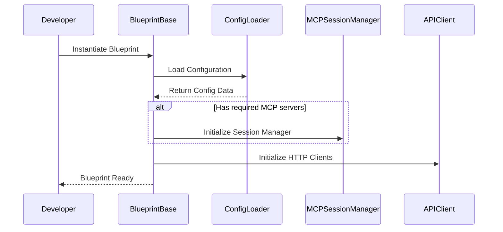
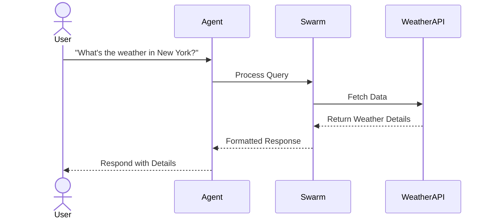
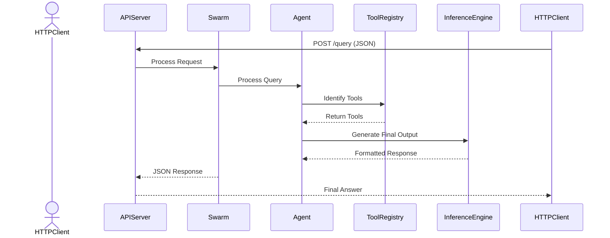

# (WIP) Development Documentation

This document provides an in-depth look at the **Swarm Framework**’s internal architecture, component interactions, and sequence flows for various operational modes. It is intended for developers and contributors who wish to modify or extend the framework.

---

## Table of Contents

- [High-Level Architecture](#high-level-architecture)
- [Detailed Sequence Diagrams](#detailed-sequence-diagrams)
  - [1. Blueprint Initialization](#1-blueprint-initialization)
  - [2. Agent Interaction Flow](#2-agent-interaction-flow)
  - [3. REST API Mode Interaction](#3-rest-api-mode-interaction)
- [Project Layout](#project-layout)
- [API Endpoints](#api-endpoints)
- [Advanced Topics](#advanced-topics)

---

## Detailed Sequence Diagrams

### 1. Blueprint Initialization



### 2. Agent Interaction Flow



### 3. REST API Mode Interaction

Below is a simplified sequence diagram of the REST API interaction using Mermaid:



---

## Project Layout

Updated directory structure for the unified framework:

```
src/
    swarm/
        agent/                 # Agent definitions and orchestration
        blueprint/             # Blueprint base classes and implementations
        config/                # Configuration loading and validation
        core.py                # Core Swarm framework logic
        extensions/            # Optional integrations (REST, GPT actions)
        repl/                  # Interactive REPL for agents
        rest/                  # REST API views and endpoints
        types.py               # Type definitions for agents and tools
        util.py                # Utility functions
tests/
    test_blueprints.py         # Tests for blueprint discovery and metadata
    test_rest_mode.py          # Tests for REST API endpoints
    test_config_loader.py      # Tests for configuration loading
    test_swarm/                # Tests for Swarm framework
docs/
    diagrams/                  # Architecture and sequence diagrams
```

---

## API Endpoints

### CLI Mode

- **No HTTP endpoints**. Interact directly with the framework using the CLI.

### REST Mode

- **`POST /v1/query`**: Accepts JSON payloads, returning agent responses in OpenAI-compatible format.
- **`GET /v1/models`**: Lists all available models (blueprints).

### MCP Mode

- **`list_tools`**: Enumerates available tools in the MCP environment.
- **`execute_tool`**: Executes a specified tool with arguments.

---

## Advanced Topics

### Blueprint Flexibility

Blueprints can:
- Use **MCP servers** for tools and actions.
- Call **direct HTTP APIs** for tasks like weather queries.
- Employ **GPT actions** as an alternative tool execution method.

### Scaling

- Use a reverse proxy (e.g., Nginx) for REST endpoints.
- Scale horizontally with multiple REST or MCP instances sharing the same configuration.

### Security

- Keep sensitive data in `.env`.
- Leverage Docker secrets or Kubernetes secrets for secure deployments.

---

For contributions or additional help, refer to our [Contributing Guidelines](../README.md#contributing).
