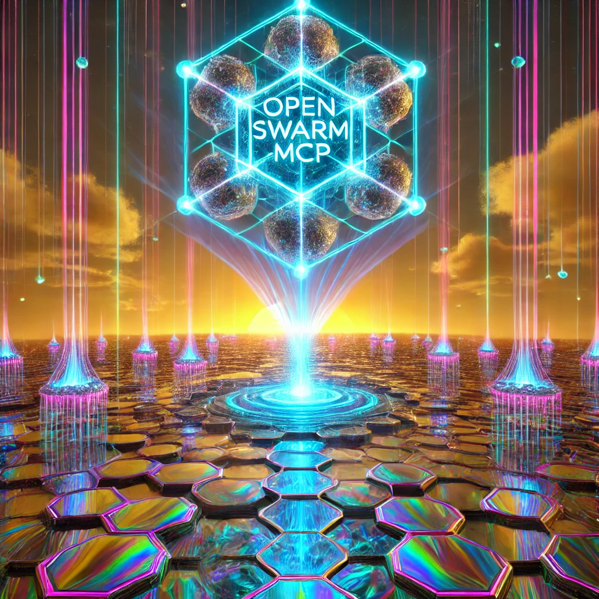

# Open Swarm MCP



**Open Swarm MCP** is a modular framework designed to integrate [OpenAI Swarm](https://github.com/openai/swarm) agents with [Anthropic’s Message Context Protocol (MCP)](https://github.com/modelcontextprotocol), enabling dynamic agent behavior across multiple operational modes. Whether you’re orchestrating a simple conversational workflow or building teams of agents that can hand off tasks between each other, Open Swarm MCP provides the flexibility and extensibility to power your project.

---

## Table of Contents

- [Introduction](#introduction)
- [Operational Overview](#operational-overview)
  - [Modes of Operation](#modes-of-operation)
  - [Architecture Diagram](#architecture-diagram)
- [Example: Triage Blueprint](#example-triage-blueprint)
  - [OpenAI-Compatible Endpoint](#openai-compatible-endpoint)
- [Blueprints](#blueprints)
  - [What are Blueprints?](#what-are-blueprints)
  - [Creating a Blueprint](#creating-a-blueprint)
- [Getting Started](#getting-started)
  - [Installation](#installation)
  - [Running with UV and Python](#running-with-uv-and-python)
  - [Deployment with Docker Compose](#deployment-with-docker-compose)
- [Further Documentation](#further-documentation)
- [TODO](#todo)
- [License](#license)

---

## Introduction

Open Swarm MCP streamlines the process of creating agentic workflows that:
- Dynamically configure **Swarm** agents with instructions, models, and tools.
- Integrate with **MCP** servers for tool orchestration.
- Operate in various modes (CLI, REST, and MCP service) to suit your environment.

This framework is suitable for:
- **Rapid Prototyping**: Spin up a local CLI environment to experiment with agent behaviors.
- **Service Deployments**: Expose agents as REST endpoints or MCP services for external integrations.
- **Agent Teams**: Leverage the MCP protocol for complex, multi-agent handoffs and dynamic tool usage.

---

## Operational Overview

### Modes of Operation

1. **CLI Mode**  
   - Ideal for local development and testing.
   - Interactive prompt for real-time agent queries.

2. **REST Mode**  
   - Exposes a REST API (compatible with many OpenAI-like interfaces).
   - Serves as a standard endpoint for external clients (e.g., chat UIs or automation scripts).

3. **MCP Host Mode**  
   - Operates as a fully MCP-compliant host.
   - Allows for advanced agent handoffs and complex orchestrations via the MCP protocol.

### Architecture Diagram

*(A high-level architecture diagram will be added here, illustrating how Swarm agents, MCP servers, and your custom tools interact. Refer to the [Development Documentation](DEVELOPMENT.md) for in-depth sequence diagrams and design details.)*

---

## Example: Triage Blueprint

A common scenario is setting up an agent that can **triage** incoming requests or user queries, deciding whether to handle them locally or pass them to other tools. In this Triage Blueprint:
- **Agent**: Evaluates user messages and chooses relevant MCP tools.
- **Tools**: Might include a knowledge-base search tool, a database query tool, or external APIs.
- **LLM Endpoint**: Exposed as an OpenAI-compatible interface.

### OpenAI-Compatible Endpoint

By running the system in **REST Mode**, you can serve the Triage Blueprint as a standard OpenAI Chat Completions endpoint. This enables frontends (like **Open-WebUI**, **Text-Generation-WebUI**, **LocalAI**, **LibreChat**, **AnythingLLM**, etc.) to connect by simply overriding the OpenAI Base URL.

Example snippet for **Open-WebUI**:
```
Base URL: http://your-mcp-service-host:8000
API Key: <leave blank or set any placeholder>
```
Your Triage Blueprint ensures that messages are routed to the right tools or agents, returning the final response as if it were a typical OpenAI model.

---

## Blueprints

### What are Blueprints?

**Blueprints** are Python modules that integrate OpenAI Swarm agents with MCP services through predefined metadata. They serve as configuration scripts that define how agents interact with various MCP servers and tools, ensuring consistent and automated setup and validation.

Each Blueprint contains an `EXAMPLE_METADATA` dictionary that outlines:
- **Title**: A human-readable name for the blueprint.
- **Description**: A brief overview of what the blueprint does.
- **Required MCP Servers**: A list of MCP servers that must be configured for the blueprint to function.
- **Environment Variables**: Necessary environment variables for the blueprint.
- **Default Arguments**: Command-line arguments or configurations needed by MCP servers.

### Creating a Blueprint

To create a new Blueprint:
1. **Directory Structure**:  
   Create a new directory within the `./blueprints/` folder named after your blueprint.
   
   Example:
   ```
   ./blueprints/my_custom_blueprint/
   ```
   
2. **Blueprint Module**:  
   Inside your blueprint directory, create a Python file named `blueprint_{your_blueprint_name}.py`.
   
   Example:
   ```python
   # ./blueprints/my_custom_blueprint/blueprint_my_custom_blueprint.py
   
   EXAMPLE_METADATA = {
       "title": "My Custom Blueprint",
       "description": "Integrates custom tools with the agent.",
       "required_mcp_servers": ["custom_server"],
       "env_vars": ["CUSTOM_ENV_VAR"],
       "default_args": "--custom-arg1 value1 --custom-arg2 value2"
   }
   ```
   
3. **Implementing Functionality**:  
   Define the necessary logic and tools within your blueprint module to interact with MCP servers as specified in the metadata.
   
4. **Validation**:  
   Ensure that your `EXAMPLE_METADATA` is a valid dictionary and includes all required fields to prevent the blueprint from being skipped during discovery.

---

## Getting Started

### Installation

1. **Clone the Repository**  
   ```bash
   git clone https://github.com/matthewhand/open-swarm-mcp.git
   cd open-swarm-mcp
   ```
   
2. **Install Dependencies**  
   ```bash
   # using uv, get it here => https://docs.astral.sh/uv/
   uv python install
   uv sync
   ```
   
3. **Setup Environment**  
   - Copy `.env.example` to `.env` and populate it with your API keys or tokens.
   - Edit `mcp_server_config.json` (in `src/open_swarm_mcp`) to reference your MCP servers and tools.

### Running with UV and Python

```bash
# Basic CLI usage (default mode, setup wizard to help generate mcp_server_config.json)
uv run src/open_swarm_mcp/main.py 

# Example blueprints
## Basic CLI usage 
uv run src/open_swarm_mcp/main.py --blueprint path_e_tech

## Expose as REST endpoint
uv run src/open_swarm_mcp/main.py --mode rest --blueprint sqlite_and_search --config mcp_server_config.json

## Run as an MCP-compliant host
uv run src/open_swarm_mcp/main.py --mode mcp-host --blueprint filesystem --config mcp_server_config.json
```

### (TODO) Deployment with Docker Compose

For production-grade deployments, **Docker Compose** simplifies running Open Swarm MCP alongside any required MCP servers or databases:

```bash
docker-compose up -d
```

Check our [Deployment Documentation](docs/DEVELOPMENT.md#docker-deployment) for an example `docker-compose.yml` file.

---

## Further Documentation

For detailed design information, sequence diagrams, and project layout references, please see our [Development Documentation](docs/DEVELOPMENT.md). Topics covered include:

- **System Components**: Agents, tools, and MCP protocol usage.
- **Sequence Diagrams**: Illustrating requests/responses in CLI, REST, and MCP Host modes.
- **Advanced Topics**: Multi-agent collaboration, custom blueprint creation, and scaling strategies.

---

## TODO
- [x] **Setup Pytest for Blueprints**
    - Implement and configure pytest to ensure all blueprint modules are correctly discovered and loaded.

- [ ] MCP Host Mode
    - [ ] Implement `run_mcp_host_mode` functionality for hosting MCP tools.
    - [ ] Add configuration support for running multiple host agents simultaneously.

- [ ] MCP Servers
    - [ ] Add support for dynamic discovery of MCP servers via a registry or environment variable.
    - [ ] Include health-check functionality for MCP servers.
    - [ ] Provide detailed error messages for misconfigured or unreachable MCP servers.
    - [ ] Support secure connections (e.g., HTTPS or authentication tokens) for MCP server endpoints.

- [ ] Fix Save/Load Configuration
    - [ ] Ensure configuration saves correctly without overwriting environment variables.
    - [ ] Validate configuration upon loading and provide user-friendly error messages for invalid files.
    - [ ] Include versioning in configuration files to handle backward compatibility.

- [ ] Blueprints
    - [ ] Display detected blueprints correctly in CLI.
    - [ ] Implement functionality to enable/disable blueprints dynamically at runtime.
    - [ ] Add default blueprints for common workflows.

- [ ] CLI Mode Enhancements
    - [ ] Fix the issue with `await` expressions in `run_cli_mode`.
    - [ ] Add a help command to list available tools and blueprints.
    - [ ] Provide context-based suggestions for invalid queries.

- [ ] REST Mode
    - [ ] Enhance REST API to allow dynamic loading/unloading of agents or tools.
    - [ ] Add error-handling middleware for robust API responses.
    - [ ] Implement a status endpoint to display agent and server health.

- [ ] Logging and Debugging
    - [ ] Add a debug mode to log detailed traces for troubleshooting.
    - [ ] Implement structured logging to JSON format for easy analysis.

- [ ] Configuration Wizard
    - [ ] Enhance setup wizard to pre-fill known values from the environment.
    - [ ] Add a "test configuration" step to validate LLM and MCP server connectivity.
    - [ ] Provide a "skip" option for optional configurations.

- [ ] Agent Enhancements
    - [ ] Add support for agent handoff between different workflows seamlessly.
    - [ ] Integrate more dynamic tooling (e.g., scraping, database queries).
    - [ ] Implement a mechanism for tool prioritization or ranking.

- [ ] Documentation
    - [ ] Create clear instructions for setting up the environment.
    - [ ] Add examples for advanced usage scenarios (e.g., chaining tools, custom blueprints).
    - [ ] Include troubleshooting steps for common issues.

- [ ] Testing
    - [ ] Write unit tests for key modules (e.g., config loader, agent builder).
    - [ ] Implement integration tests for CLI and REST modes.
    - [ ] Add mock tools and servers for testing without dependencies.

- [ ] Additional Enhancements
    - [ ] Add support for external plugin loading to expand functionality.
    - [ ] Include rate-limiting features for MCP tools and REST endpoints.
    - [ ] Introduce caching for frequently used results or configurations.

- [ ] Modularization
    - [ ] Break down monolithic files (e.g., `agent_builder.py`) into smaller, focused modules.
    - [ ] Implement a plugin system for easy addition/removal of tools or blueprints.

- [ ] UX Improvements
    - [ ] Provide better feedback messages for CLI and REST interactions.
    - [ ] Add interactive visualization (e.g., graph of agents and tools).

- [ ] Future Features (optional)
    - [ ] Enable persistent memory for agents (context-awareness across sessions).
    - [ ] Integrate with third-party services (e.g., Slack, Discord).
    - [ ] Explore adding support for non-LLM backends (e.g., traditional ML models).

---

## License

Open Swarm MCP is licensed under the MIT License. See the [LICENSE](LICENSE) file for details.

---

*Thank you for choosing Open Swarm MCP. If you have any questions, issues, or suggestions, feel free to open an issue or contribute a pull request on our [GitHub repository](https://github.com/matthewhand/open-swarm-mcp).*
