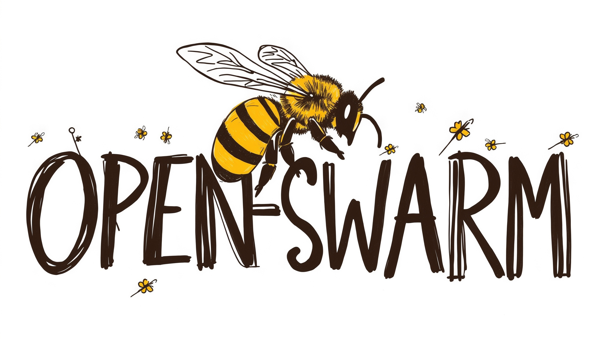
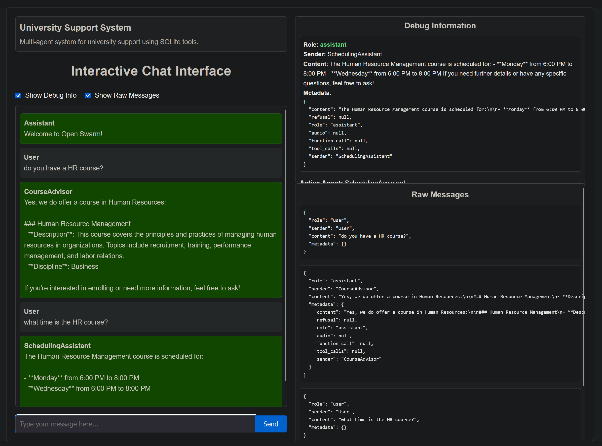

# Open Swarm

<div align="center">

</div>

**Open Swarm** is a versatile, modular framework for building intelligent, multi-agent systems. It's a **fork and actively maintained extension** of the [OpenAI Swarm](https://github.com/openai/swarm) framework. It includes modifications to support stateless RESTful operations and a plugin system for custom extensions that enhance agentic workflows.

---

## Table of Contents
- [Key Features](#key-features)
- [Blueprints](#blueprints)
- [Operational Modes](#operational-modes)
- [Configuration & Multiple LLM Providers](#configuration--multiple-llm-providers)
- [Installation](#installation)
- [Running Open Swarm](#running-open-swarm)
- [Deploying with Docker](#deploying-with-docker)
  - [Deploy with Docker Compose (Recommended)](#deploy-with-docker-compose-recommended)
  - [Deploy Standalone](#deploy-standalone)
- [Progress Tracker](#progress-tracker)
- [Further Documentation](#further-documentation)
- [License](#license)

---

## Key Features

1. **Multi-Agent Orchestration**  
   - Define multiple agents, each with unique instructions and roles.
   - Agents coordinate tasks, share context, or hand off queries between one another.

2. **Blueprint-Driven Architecture**  
   - Each **Blueprint** encapsulates logic, tool connections, and environment/config settings.
   - Encourages reusable, modular patterns for different use cases.

3. **Optional MCP or GPT Actions**  
   - (WIP) Integrate with external tools (e.g., databases, web search, filesystems) through **MCP servers**.
   - (TODO) Use **GPT Actions** as an alternative for agent expansions without dedicated MCP infrastructure.

4. **CLI & REST Interface**  
   - A setup wizard helps define or update blueprint configurations.
   - Run from the command line or expose a Django-powered REST API for broader integration.
   - Interactive web pages per blueprint at `/<blueprint_name>/`.

5. **OpenAI API Compatibility**  
   - Exposes an endpoint at `/v1/chat/completions` that is functionally similar to the OpenAI Chat Completions API.
   - Includes a **mandatory** `sender` field in agent responses.  
     - This field identifies which Swarm agent provided the response and must be preserved in the conversation history for proper handoffs between agents.
     - While the framework is compatible with OpenAI-like API clients, it assumes the client application maintains the `sender` field and, ideally, displays it in the user interface.
     - **Note:** Most OpenAI API-compatible applications will ignore the `sender` field by default and not display the agent name. Custom UI or logic is required to utilise and present this information.

6. **(WIP) Configurable LLM Providers**  
   - Supports multiple OpenAI-compatible providers in a single environment (e.g., `openai`, `grok`, `ollama`).
   - Allows specifying different models/providers for different agents—even within the same blueprint.
   - Use environment variable `LLM` to specify default llm model provider used by blueprints, ie `LLM=ollama`

---

## Blueprints

A **Blueprint** is a Python module that wraps:

- **Agent Logic**: Defines how each agent in the Swarm processes user messages, whether it calls tools, and how it decides to hand off to other agents.
- **Tools**: Specifies which agents have which tools (e.g. a read-only SQLite database) the agents may invoke.
- **Environment & Configuration**: Ensures required environment variables and JSON configs are validated prior to agent execution.

Once registered, a blueprint is discoverable at runtime, allowing the system to list and load agents on demand.

### University Support Example

Consider a **University Support Blueprint** that orchestrates multiple agents to handle campus-related queries:

1. **Triage Agent**  
   - Inspects each incoming query (e.g., *“Which courses are recommended for data science?”*).  
   - Determines whether to route it to a **Course Advisor**, **Scheduling Assistant**, or a creative **Campus Culture** responder.  
   - Demonstrates handoffs by returning the specialised agent most suited to the query.  

2. **Course Advisor Agent**  
   - Relies on a read-only SQLite database (exposed as an MCP server tool) for course recommendations.  
   - Executes queries like `SELECT * FROM courses WHERE discipline='Data Science';` via a method such as `read_query()`.

3. **Scheduling Assistant Agent**  
   - Accesses a separate scheduling database to provide timetables, exam schedules, and important dates.  
   - Responds in short, factual statements, suitable for quick reference.

In practice, this blueprint:
- Bundles the agent instructions and personalities (e.g., helpful advisor, factual scheduler).  
- Requires environment variable, `OPENAI_API_KEY` for LLM inference.  
- Performs both **CLI** and **REST** interactions, so you can either run it locally or expose it as a service through `/v1/chat/completions`.

### Other Examples
Open Swarm showcases a growing library of **Blueprint** examples:

| Blueprint Name          | Description                                                                 |
|-------------------------|-----------------------------------------------------------------------------|
| **Echo Blueprint**      | A straightforward agent that simply echoes user inputs—ideal for testing or as a starter template. |
| **Database and Web Blueprint** | Demonstrates MCP-based integration with an SQLite database and Brave Search, illustrating how to combine data retrieval with real-time web queries. |
| **Filesystem Blueprint** | Provides agents that can interact with local file directories (read/write operations) through a **filesystem** MCP server. |
| **Weather Blueprint**   | Fetches current weather and forecasts via external APIs (e.g., OpenWeatherMap), showing how environment variables and requests-based calls can be integrated. |

---

## Operational Modes

1. **CLI Mode**  
   - Run `uv run src/swarm/main.py --wizard` to configure blueprints interactively.  
   - Execute specific blueprint files (e.g., `uv run blueprints/university/blueprint_university.py`).  
   - Great for local testing, debugging, and iterative development.

2. **REST Mode**  
   - Launch Django with `uv run manage.py runserver 0.0.0.0:8000`.  
   - Access endpoints:
     - `POST /v1/chat/completions`: Chat-style agent interactions (OpenAI-compatible).
     - `GET /v1/models`: Lists available blueprints.
     - `http://localhost:8000/<blueprint_name>/`: Interactive, web-based blueprint tester.
   - (TODO) Optionally integrate with Django Admin at `/admin`.

---

## Configuration & Multiple LLM Providers

Open Swarm uses:
- **`.env`** files for API keys or critical environment variables (e.g., `OPENAI_API_KEY`).  
- **`swarm_config.json`** (or custom JSON) for advanced settings:
  - **`llm_providers`**: Define multiple OpenAI-compatible endpoints (e.g., `openai`, `grok`, `ollama`).
  - **`mcp_servers`**: Tools/services that agents can call.
  - **`gpt_actions`**: (TODO) More tools/services that agents can call.

Different agents in a single blueprint can reference different LLM providers. For example:
```json
{
  "llm_providers": {
    "openai": {
      "provider": "openai",
      "model": "gpt-4",
      "base_url": "https://api.openai.com/v1",
      "api_key": "${OPENAI_API_KEY}"
    },
    "grok": {
      "provider": "openai",
      "model": "grok-2-1212",
      "base_url": "https://api.x.ai/v1",
      "api_key": "${XAI_API_KEY}"
    }
  }
}
```
These references let you quickly switch providers based on environment or agent specificity.

---

## Installation

1. **Clone the Repository**  
   ```bash
   git clone https://github.com/matthewhand/open-swarm.git
   cd open-swarm
   ```
2. **Install Dependencies**  
   ```bash
   # Get 'uv' here => https://docs.astral.sh/uv/
   uv python install
   uv venv
   source .venv/bin/activate
   uv sync
   ```
3. **Environment Setup**  
   - Copy `.env.example` to `.env` and fill in sensitive details (`OPENAI_API_KEY`, etc.).
   - *(Optional)* Update `swarm_config.json` to add or modify LLM providers, MCP servers, etc.

---

## Running Open Swarm

### Running with the CLI

1. **Run the Setup Wizard (Optional):**
    ```bash
    uv run src/swarm/main.py --wizard
    ```
    *   This will allow you to configure the default LLM model and blueprint you wish to use.

2.  **Execute a Specific Blueprint:**
    ```bash
    uv run blueprints/university/blueprint_university.py
    ```
    *   This will execute the `UniversitySupportBlueprint` in interactive mode, starting with the `TriageAgent`.
    *   You can then enter a query at the prompt, and the system will automatically route this through the appropriate agent, with any handoffs between agents done automatically by the Swarm framework.
    *  Try entering queries like:
        *   `"What courses should I take next semester if I’m interested in data science?"` to test the handoff to the `CourseAdvisor`
        *   `"Write me a poem about the university cafeteria,"` to test the handoff to the `UniversityPoet`
        *  `"What time is the Artificial Intelligence exam?"` to test the handoff to the `SchedulingAssistant`
     * Please note that using the CLI will only show the default text responses. To experience the multi-agent orchestration with a full UI, and with voice, it is recommended to use Open WebUI (see the REST instructions below)

### Running with the REST API

1.  **Start the Django REST API Server:**
    ```bash
    uv run manage.py runserver 0.0.0.0:8000
    ```

2.  **Access the Interactive Blueprint Pages:**
    *   Open your web browser and visit:
        *   `http://localhost:8000/<blueprint_name>/` (e.g., `http://localhost:8000/university/`)

        *   You will see a text input where you can type queries.
        *   The `sender` of the response (the name of the agent that responded) will be shown above each response.
        *   Below is a screenshot showing an example of the interactive HTML page:

            

3.  **Integrate with Open WebUI:**
    *    Open Swarm has full compatibility with OpenAI API-compatible UIs, such as [Open WebUI](https://github.com/open-webui/open-webui). By using a client like Open WebUI you will not only see the `sender` field, but also experience a more engaging chat UI with other features.
    *   To configure Open WebUI to use Open Swarm:
        *   Start the REST API server via `uv run manage.py runserver 0.0.0.0:8000`
        *   Install the custom function from the [Open WebUI Functions Hub](https://openwebui.com/f/matthewh/swarm_manifold).
        *   In the custom function valve settings, change the API Base URL if different to the default, `http://host.docker.internal:8000`

    * To see a demo of Open WebUI with the University Blueprint with expressive voice output, please see the following demonstration video:

https://github.com/user-attachments/assets/a4688100-5737-479f-91e5-974db98296d7

5.  **Access the REST Endpoints Directly:**
   You can also interact with the API using a tool like `curl`. For example:
    ```bash
    curl -X POST http://localhost:8000/v1/chat/completions \
        -H "Content-Type: application/json" \
        -d '{"model":"university","messages":[{"role":"user","content":"What courses should I take next semester if I’m interested in data science?"}]}'
    ```
    *   You will see a JSON response, containing the `sender` field within the response (in `data.choices[0].message.sender`).

---

## Deploying with Docker

### Deploy with Docker Compose (Recommended)

1. **Obtain `docker-compose.yaml`**  
   ```bash
   wget https://raw.githubusercontent.com/matthewhand/open-swarm/refs/heads/main/docker-compose.yaml
   ```
2. **Configure `.env` & (Optional) `swarm_config.json`**  
   - Ensure `.env` has `OPENAI_API_KEY`.  
   - Adjust `swarm_config.json` if you want to use local LLM endpoints or different providers. 

3. **Start the Service**  
   ```bash
   docker compose up -d
   ```
   This:
   - Builds the image if needed.
   - Reads port settings and environment variables from `.env`.
   - Exposes the application on `8000` (unless overridden via `$PORT`).

4. **Access**  
   - Visit [http://localhost:8000](http://localhost:8000) for the interactive blueprint pages.

### Deploy Standalone (TODO) 

```bash
docker run \
  --env-file .env \
  -p 8000:8000 \
  open-swarm:latest
```
*(An official Docker image is planned for registry release.)*

---

## Diagram: Backend HTTP Service Overview

Below is a simplified diagram illustrating how the **Open Swarm** HTTP service can function as a backend for any OpenAI API-compatible client or tool. The service lists configured **Blueprints** via `/v1/models` and performs inference through the `/v1/chat/completions` endpoint. Internally, it can call out to any configured **OpenAI-compatible LLM provider** (OpenAI, Grok, Ollama, etc.) and optionally run **GPT Actions** or **MCP servers** (like database, filesystem, or weather integrations).

```
 ┌─────────────────────────────────────────────────────────────────────┐
 │        OpenAI-Compatible Client Tools (AnythingLLM, LibreChat)      │
 │                           or Open-WebUI, etc.                       │
 └────────────┬────────────────────────────────────────────────────────┘
              |                             
              |   (HTTP: /v1/chat/completions, /v1/models, etc.)
              ▼                             
 ┌─────────────────────────────────────────────────────────────────────┐
 │                 Open Swarm REST API Service (Django)                │
 │        (Exposes /v1/models, /v1/chat/completions, /admin)           │
 └─────────────────────────────────────────────────────────────────────┘
                     |                        | 
                     |                        | MCP Servers and 
       (Mandatory)   |                        | GPT Actions (TODO) 
       LLM Inference |                        | (filesystem,    
                     |                        | database, etc.)           
                     ▼                        ▼                
       ┌────────────────────────┐         ┌────────────────────────┐
       │OpenAI-Compatible LLMs  │         │ External APIs/Services │
       │ (OpenAI, Grok, Ollama) │         │ (Weather, Database, ..)│
       └────────────────────────┘         └────────────────────────┘
```

---

## Progress Tracker

- **REST Mode**  
  - [x] Inference via `/v1/chat/completions`  
  - [x] Blueprints listed via `/v1/models/`  
  - [x] Execute blueprints via `/<blueprint>` i.e. http://localhost:8000/university
  - [x] Simple HTML page
  - [ ] Application management via `/admin`  
   - [x] User management
   - [ ] Blueprint management

- **CLI Mode**  
  - [x] Setup Wizard  
  - [x] Blueprint Runner  

- **Multiple LLM Providers**  
  - [ ] Assign different providers/models per agent in one blueprint  

- **Docker**  
  - [x] Dockerfile and docker-compose.yaml  
  - [ ] Publish to Docker Registry  

- **PyPI Publishing**  
  - [ ] Publish Python module to PyPI  

- **Example Blueprints**  
  - [x] `university`  
  - [x] `echo`
  - [x] `weather`  
  - [ ] `database_and_web` (SQLite & Brave Search)  
  - [ ] `filesystem`  

- **Security**  
  - [ ] Securing REST completions endpoint with API_KEY
  - [ ] CORS access control

---

## Further Documentation

For advanced usage, sequence diagrams, or in-depth tooling examples, see [DEVELOPMENT.md](./DEVELOPMENT.md). Additional expansions and best practices for agent orchestration, LLM provider swapping, and more can be found in that document.

---

## License

Open Swarm is provided under the MIT License. Refer to the [LICENSE](LICENSE) file for full details.

## Acknowledgements

This project is based on the [OpenAI Swarm](https://github.com/openai/swarm) framework. We would like to acknowledge the original authors and contributors of this project for their work.
